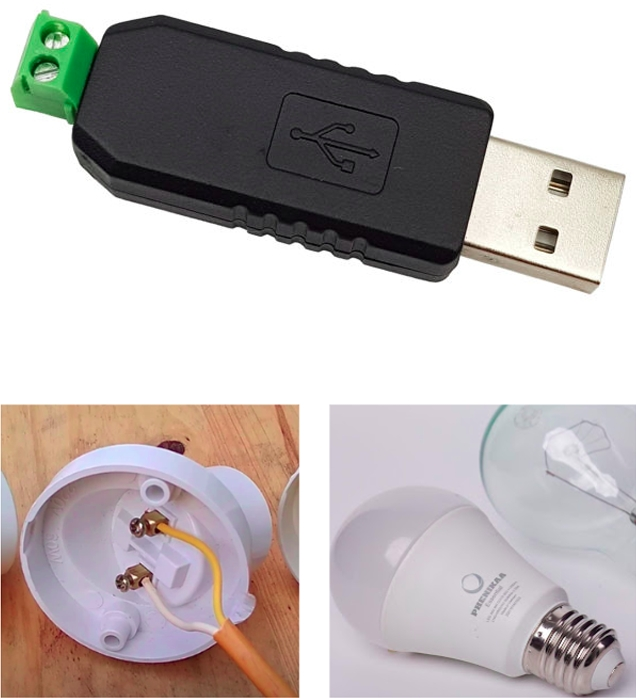

# Light Controlling Using Hand Gestures


Dự án "Light Controlling Using Hand Gestures" phát triển một hệ thống cho phép người dùng điều khiển đèn thông qua các cử chỉ tay. Dự án này kết hợp công nghệ nhận diện cử chỉ của Google (MediaPipe Gesture Recognizer) với một mô hình học sâu (Deep Learning Model) để tạo ra một hệ thống nhận diện cử chỉ tay và thực thi các lệnh tương ứng với các cử chỉ đã được định nghĩa trước. Hệ thống có khả năng điều khiển đèn trong môi trường mô phỏng hoặc các thiết bị đèn thực tế thông qua module relay Modbus RTU RS485.

## Tính năng chính

*   **Nhận diện cử chỉ tay thời gian thực**: Sử dụng MediaPipe Gesture Recognizer để phát hiện và trích xuất các điểm mốc (landmarks) của bàn tay từ webcam.
*   **Mô hình học sâu**: Một mô hình MLP (Multi-Layer Perceptron) được huấn luyện để phân loại các cử chỉ tay thành các hành động điều khiển đèn cụ thể.
*   **Điều khiển đèn linh hoạt**: Hỗ trợ điều khiển đèn trong môi trường mô phỏng và điều khiển thiết bị đèn vật lý thông qua module relay 4 kênh Modbus RTU RS485.
*   **Dễ dàng mở rộng**: Cấu hình các cử chỉ và hành động tương ứng thông qua file `hand_gesture.yaml`, cho phép dễ dàng thêm hoặc chỉnh sửa các cử chỉ mới.
*   **Thu thập dữ liệu tự động**: Công cụ `generate_landmark_data.py` giúp thu thập dữ liệu cử chỉ tay một cách hiệu quả để huấn luyện mô hình.

## Cấu trúc dự án

Dự án được tổ chức với các thư mục và file chính sau:

```
Light-Controlling-Using-Hand-Gestures/
├── data/                       # Chứa các file CSV dữ liệu landmarks (train, val, test)
├── img/                        # Chứa các hình ảnh minh họa cho README
├── models/                     # Chứa mô hình học sâu đã huấn luyện
├── sign_imgs/                  # Chứa hình ảnh mẫu của các cử chỉ
├── .gitignore                  # Các file và thư mục bỏ qua khi commit Git
├── Light Controlling Using Hand Gestures.pdf # Tài liệu hướng dẫn chi tiết dự án
├── README.md                   # File README của dự án
├── controller.py               # Xử lý logic điều khiển đèn (giao tiếp với relay)
├── detect_simulation.py        # Mô phỏng nhận diện cử chỉ và điều khiển đèn
├── generate_landmark_data.py   # Script thu thập dữ liệu landmarks từ cử chỉ tay
├── hand_gesture.yaml           # Cấu hình các cử chỉ tay và hành động tương ứng
├── model.py                    # Định nghĩa kiến trúc mô hình học sâu
├── requirements.txt            # Danh sách các thư viện Python cần thiết
├── train.py                    # Script huấn luyện mô hình học sâu
└── utils.py                    # Các hàm tiện ích chung
```

## Cài đặt

Để cài đặt và chạy dự án, bạn cần thực hiện các bước sau:

### 1. Môi trường Python

Chúng tôi khuyến nghị sử dụng `conda` để tạo môi trường ảo với Python 3.10:

```bash
conda create -n gesture_env python=3.10.0
conda activate gesture_env
```

### 2. Cài đặt thư viện

Sau khi kích hoạt môi trường, cài đặt các thư viện cần thiết từ `requirements.txt`:

```bash
pip install -r requirements.txt
```

## Sử dụng

### 1. Cấu hình cử chỉ

File `hand_gesture.yaml` định nghĩa các cử chỉ tay và hành động điều khiển đèn tương ứng. Bạn có thể chỉnh sửa file này để thêm hoặc thay đổi các cử chỉ:

```yaml
gestures:
  0: "turn_off"
  1: "light1"
  2: "light2"
  3: "light3"
  4: "turn_on"
```

### 2. Thu thập dữ liệu cử chỉ

Sử dụng `generate_landmark_data.py` để thu thập dữ liệu landmarks cho các cử chỉ tay. Dữ liệu này sẽ được sử dụng để huấn luyện mô hình.

```bash
python generate_landmark_data.py
```

**Hướng dẫn thu thập dữ liệu:**

*   Chương trình sẽ tự động tạo các file `landmark_train.csv`, `landmark_val.csv`, `landmark_test.csv` trong thư mục `data/`.
*   Khi chương trình chạy, bạn sẽ thấy cửa sổ webcam. Nhấn phím tương ứng với class cử chỉ bạn muốn ghi (ví dụ: 'a' cho class 0, 'b' cho class 1, v.v.).
*   Thực hiện cử chỉ trước camera. Dữ liệu sẽ được ghi lại liên tục.
*   Nhấn lại phím đã chọn để dừng ghi dữ liệu cho cử chỉ đó.
*   Lặp lại quá trình cho các cử chỉ khác. Sau khi hoàn tất tất cả các class, nhấn 'q' để thoát chương trình.

### 3. Huấn luyện mô hình

Sau khi có dữ liệu, bạn có thể huấn luyện mô hình phân loại cử chỉ bằng cách chạy:

```bash
python train.py
```

Mô hình đã huấn luyện sẽ được lưu trong thư mục `models/`.

### 4. Điều khiển đèn (Mô phỏng)

Để chạy mô phỏng điều khiển đèn bằng cử chỉ tay, sử dụng:

```bash
python detect_simulation.py
```

Chương trình sẽ sử dụng webcam để nhận diện cử chỉ của bạn và hiển thị hành động điều khiển đèn tương ứng trên màn hình.

### 5. Điều khiển đèn (Thực tế - IoT)

Để điều khiển đèn vật lý, bạn cần module relay 4 kênh Modbus RTU RS485 và bộ chuyển đổi USB sang RS485. Kết nối các thiết bị theo sơ đồ và chạy:

```bash
python controller.py
```

**Lưu ý**: Đảm bảo rằng cổng COM và địa chỉ Modbus trong `controller.py` được cấu hình chính xác để phù hợp với thiết lập phần cứng của bạn.

## Cử chỉ và Hành động

Bảng dưới đây mô tả các cử chỉ tay được định nghĩa và hành động điều khiển đèn tương ứng:

| Class | Hành động           | Cử chỉ tay                                    |
|-------|---------------------|-----------------------------------------------|
| 0     | Tắt tất cả đèn      |  |
| 1     | Bật đèn 1           |           |
| 2     | Bật đèn 2           |           |
| 3     | Bật đèn 3           |           |
| 4     | Bật tất cả đèn      |          |

## Thiết bị phần cứng

Để triển khai hệ thống điều khiển đèn vật lý, bạn cần các thiết bị sau:

*   **Module Relay 4 kênh Modbus RTU RS485**:

    
*   **Bộ chuyển đổi USB sang RS485**: 

    
*   **Đèn và các thiết bị điện khác** (tùy chọn).

## Quy trình thực hiện dự án

Quy trình thực hiện dự án được chia thành ba bước chính:


*   **Bước 0 (Chuẩn bị dữ liệu)**: Thu thập dữ liệu cử chỉ tay bằng MediaPipe Gesture Recognizer và lưu vào các file CSV.
*   **Bước 1 (Huấn luyện mô hình)**: Xây dựng và huấn luyện mô hình MLP để phân loại cử chỉ.
*   **Bước 2 (Triển khai hệ thống)**: Nhận diện cử chỉ thời gian thực và điều khiển đèn.


